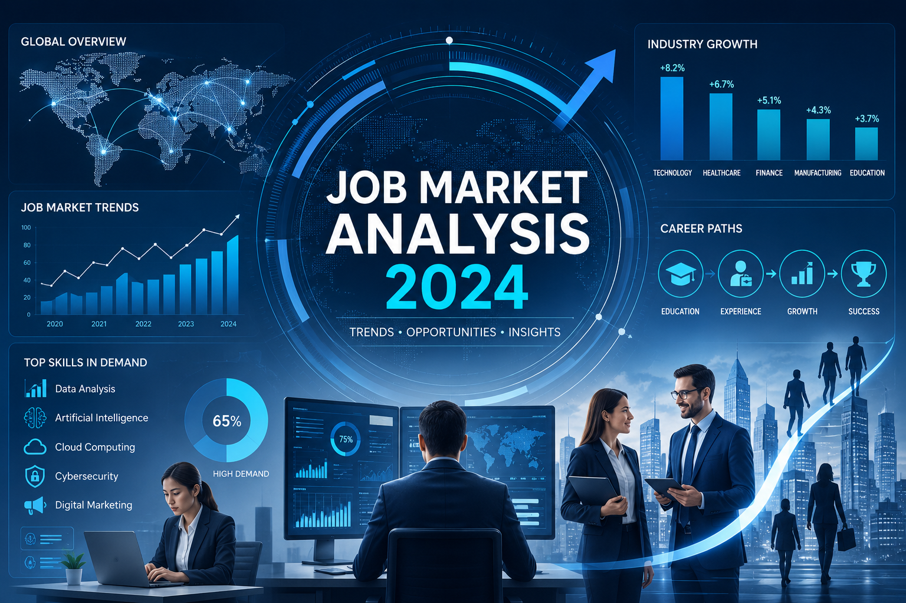

Welcome to our Job Market Analysis project! Utilizing the comprehensive **Lightcast job postings dataset**, our team leveraged Python and PySpark to perform large-scale data cleaning, exploratory data analysis (EDA), salary trend evaluations, and predictive modeling. This project aims to uncover the latest dynamics of the 2024 job market and map out strategic career paths for our team.

{.hero-image}
---

## 📌 Project Highlights & Executive Summary

### 1. [Project Overview](introduction.html)
* **The Core Issue**: Driven by persistent inflation and rising cost-of-living pressures in 2024, compensation has become a focal point of anxiety and debate for both employers and job seekers.
* **The AI Impact**: The explosive growth of Artificial Intelligence has catalyzed structural shifts in the workforce. Our study investigates and validates the existence of a significant **"AI Wage Premium"** and better remote-work benefits associated with AI roles.

### 2. [Data Preparation](data_cleaning.html)
* **Data Scale**: We initiated our pipeline with a massive raw dataset consisting of **72,498 job postings**.
* **Data Pipeline**: Cleaned the dataset by removing missing/duplicate IDs, trimming whitespaces, and synthesizing an `ANALYSIS_SALARY` variable.
* **Advanced Imputation**: Implemented an "Industry-Median Imputation" strategy for missing salaries. This successfully expanded our usable salary sample size from 32,394 to **39,244 records**, providing a robust foundation for downstream predictive modeling.

### 3. [Exploratory Analysis](eda.html)
* **Geographic & Industry Clusters**: **Texas** and **California** emerged as the top states with the highest concentration of job postings. The most dominant industry sectors demanding talent were **Custom Computer Programming Services** and **Management Consulting**.
* **Remote Work Insights**: A notable 78.1% of job postings lacked explicit remote-work tags ("Unknown"). To ensure analytical rigor, we isolated explicitly labeled roles (e.g., Remote, Hybrid) for our workplace flexibility studies.

### 4. [Salary & Compensation Trends](salary_analysis.html)
* **AI Wage Premium Verified**: **AI-related roles commanded an average salary of \$128,837.87**, outperforming non-AI roles (\$113,127.44) by approximately 14%.
* **Regional Premium Leaders**: **South Dakota** and **New Mexico** yielded the highest AI salary premiums, where AI roles paid up to 42% more than traditional occupations.
* **Remote Work Dividend**: Job postings explicitly designated as **Remote** demonstrated higher median salaries and overall superior pay distributions compared to full On-Site and Hybrid arrangements.

### 5. [Skill Gap Analysis](skill_gap_analysis.html)
* **Market Baseline Demands**: Hard technical competencies like **Python (95%)** and **SQL (88%)** represent non-negotiable entry barriers for data roles, closely followed by Machine Learning (75%) and Cloud Computing (65%).
* **Team Deficits Identified**: A comparison between team capabilities and market demands exposed critical, high-priority gaps in **Python (-2.25)**, **Machine Learning (-2.00)**, and **SQL (-1.90)**.

### 6. [Predictive Modeling](ml_methods.html)
* **Model Performance**: Built a Multiple Linear Regression model using PySpark ML to predict salaries based on location, job title, and core skills. The model achieved an **$R^2$ score of 0.269**, explaining roughly 27% of the variance in salary.
* **Feature Insights**: Entry-level or standard analyst titles (such as *Data Analyst II* or *BI Analyst*) exhibited sharp negative coefficients (-\$61k to -\$75k), proving that explicit job titles dictate market pricing heavily.

### 7. [Career Strategy](career_plan.html)
* **Actionable Roadmap**: To bridge the identified skill gaps, our team established a phased upskilling strategy. In the short term, we are focusing on mastering Python, SQL, and collaborative workflows via Git/GitHub. Long-term goals include transforming Machine Learning and Cloud Computing (AWS/GCP) into core competitive advantages.

---

## 👥 Meet the Team

We are Graduate Students pursuing our Master of Science in Applied Business Analytics (MSABA) at Boston University:

* **Afreen Alam**
* **Nutchanon Chaiyaratana**
* **Lo Ying Wu**
* **Tsyr Rau Chen**